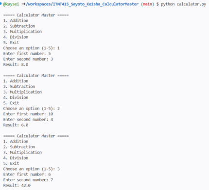

# Calculator Master

**Student Name:** Keisha Sayoto
**Course and Section:** ITNT415 - BIT42

## Project Description
A menu-driven Python calculator developed using Git and GitHub branching. The final version integrates all operations into a single application.

## Branch Structure
- main
- addition_Sayoto
- subtraction_Sayoto
- multiplication_Sayoto
- division_Sayoto

## Program Features
- Menu-driven interface
- Addition, subtraction, multiplication, and division
- User input validation
- Continuous execution until the exit option
- Error handling for invalid entries
- Division-by-zero handling

## Sample Execution Screenshot

